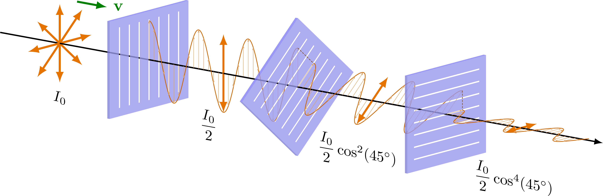

---

title: Casio DB-36 Inverted Display Mod
date: 2023-05-05T10:21:20+05:30
draft: false
type: posts
categories: 
tags:

- Matrix
- Pixel
- Retro
- Consoom

---

I had been meaning to try an inverted display mod on one of my Casio watches, and now finally I had the time and money to get a polarizing filer and do it and see for myself......

**time**..... with the reversed polarity.

In simple terms this mod i.e. modification basically takes the display, and inverts its colours. Now what does that do ? It makes me a cooler person.  It is acheived by removing the old polarizing filter and putting on a new filter that blocks and allows the opposite directions of polarized light, generating this effect. I tried it on this watch since it is pretty old and beat up. Even though it may be beat up, I hold a lot of attachment for this watch and this modification adds some more to it. Below you can see the display without the filter, bear in mind that it is still running. Only the light in the black regions isnt blocked by the filter to produce the dark numbers.
The peices of filter above appear dark as they block some amount of the light from my lamp which is not polarized in the preffered direction. In the watch they do the same but in specific regions to produce the numbers.

### A bit of science for the nerds

So light travels in planes, polarizing is simply taking the light and twisting it into a different plane of propagation. Dont confuse with refraction, here the light still travels in the same direction, only gets a twisted into a different plane. 

## What does it do in the display ?

LCD display's contain chiral compounds which polarize light, here we use a polarizing filter to block out light that is in not the preffered plane. 
So the light that is not bent in the preffered angle gets blocked and the rest can pass through. This creates the black letters in the display as all the light in those regions is blocked, while it passes through the rest.
By changing the filter we can block the light around the digits, and allow the light through them inverting the colour scheme. 

So in case you are meaning to try this for yourself, I've got a few tips

* Dont try local TV repair stores for the polarizer, they dont have smaller films and they try to scam you anyways. 
* Make sure your blade isnt warped or else it will cut your polarizer while you're removing it. 
* It takes a while to grow into the new inverted display, so dont regret doing this mod too early. 

Local TV repair uncles and bhaiyas are too critical of your intrest in TV screen polarizers anyway. You get that weird stare from them when you ask them if they have one for sale, and usually its acompanied by a question "karoge kya iska ?" "kis liye chahiye ?" I just told them I needed it for a college project, which soon changed to "college projector" as they told their ustaad ji about this kid with an unusual request. Its the easiest thing to tell to anyone when they get critical of your creative endavours, college project. The whole roadmap of college to degree to placement to marrige flashes before them as their criticism changes to praise. They might question the quest for creative satisfaction, but no one shall dare to question the quest for sociteal validation. 

